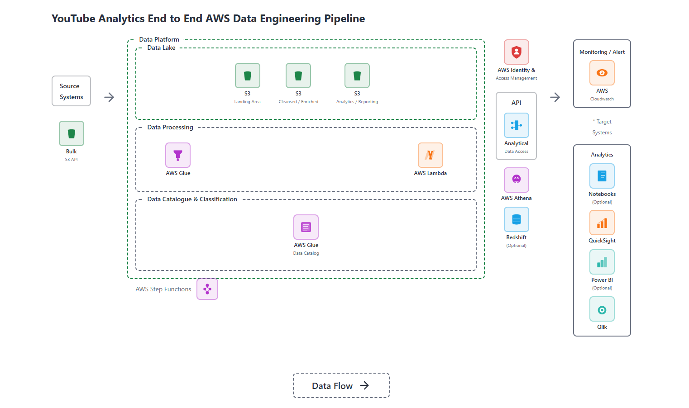

# YouTube Trending Analytics Pipeline

An AWS-based data engineering project that transforms raw YouTube trending datasets into query-ready, partitioned Parquet data.

## Architecture



The pipeline uses two processing paths:

1. **Category metadata** — An Amazon S3 object-created event invokes AWS Lambda. The function reads nested JSON, normalizes the `items` collection, writes Parquet to the cleansed zone, and updates the AWS Glue Data Catalog.
2. **Video statistics** — An AWS Glue PySpark job reads cataloged CSV data, filters configured regions, standardizes the schema, removes null-only fields, and writes region-partitioned Parquet to Amazon S3.

Athena or another catalog-aware analytics service can query the cleansed datasets.

## Repository structure

```text
.
├── data/raw/                  # Small sample and placeholder source files
├── docs/
│   ├── ARCHITECTURE.md        # Component and data-flow details
│   ├── SECURITY.md            # IAM and credential-handling model
│   └── Architecture.PNG       # Architecture diagram
├── src/
│   ├── ingestion/Ingestion.py
│   └── transformation/Transformation.py
├── .env.example
├── .gitignore
└── requirements.txt
```

## Technology stack

- Amazon S3
- AWS Lambda
- AWS Glue and Glue Data Catalog
- Amazon Athena
- Python, pandas, AWS SDK for pandas
- PySpark and AWS Glue DynamicFrames
- Parquet with region partitioning

## Processing flow

### Category metadata

```text
Raw JSON in S3 → S3 event → Lambda → normalized DataFrame
→ Parquet in cleansed S3 → Glue Catalog
```

### Video statistics

```text
Raw CSV in S3 → Glue Catalog → Glue PySpark job
→ schema normalization → region filter → partitioned Parquet
```

## Configuration

### Lambda environment variables

| Variable | Purpose | Example |
|---|---|---|
| `S3_CLEANSED_PATH` | Destination dataset URI | `s3://example-cleansed/youtube/categories/` |
| `GLUE_DB_NAME` | Glue database | `youtube_cleansed` |
| `GLUE_TABLE_NAME` | Glue table | `categories` |
| `WRITE_MODE` | Wrangler write mode | `overwrite` |

Legacy lowercase variable names remain supported for compatibility.

### Glue job arguments

| Argument | Purpose | Default |
|---|---|---|
| `--SOURCE_DB` | Source Glue database | `de_youtube_raw` |
| `--SOURCE_TABLE` | Source Glue table | `raw_statistics` |
| `--TARGET_S3_PATH` | Cleansed S3 destination | Required |
| `--REGIONS` | Comma-separated regions | `ca,gb,us` |

## Deployment prerequisites

1. Create separate raw and cleansed S3 locations.
2. Create the Glue databases, source table/crawler, and execution role.
3. Deploy the Lambda function with an execution role scoped to the required S3 prefixes and Glue table.
4. Configure an S3 object-created notification for category JSON files.
5. Create the Glue job with its source, destination, and region arguments.
6. Query the cleansed catalog tables through Athena.

The repository intentionally does not contain cloud credentials. AWS workloads should receive temporary credentials from IAM execution roles. See [Security](docs/SECURITY.md).

## Local development

```bash
python -m venv .venv
source .venv/bin/activate
pip install -r requirements.txt
```

AWS Glue libraries are supplied by the managed Glue runtime and are not installed through this requirements file.

## Design considerations

- Parquet reduces scan volume compared with CSV or JSON.
- Region partitioning supports predicate pruning in Athena.
- Configuration is externalized so the same code can run across environments.
- Structured logs preserve the object key and bucket without exposing credentials.
- Production IAM policies should follow least privilege.

## Current limitations

- Infrastructure-as-code is not yet included.
- The pipeline processes batch files rather than the YouTube API.
- Data-quality checks and automated integration tests are future work.
- `coalesce(1)` is configurable because forcing one output file does not scale for large datasets.

## Author

**Vishwanath Gogi** — Data Engineer  
[GitHub profile](https://github.com/VishwanathGogi)
